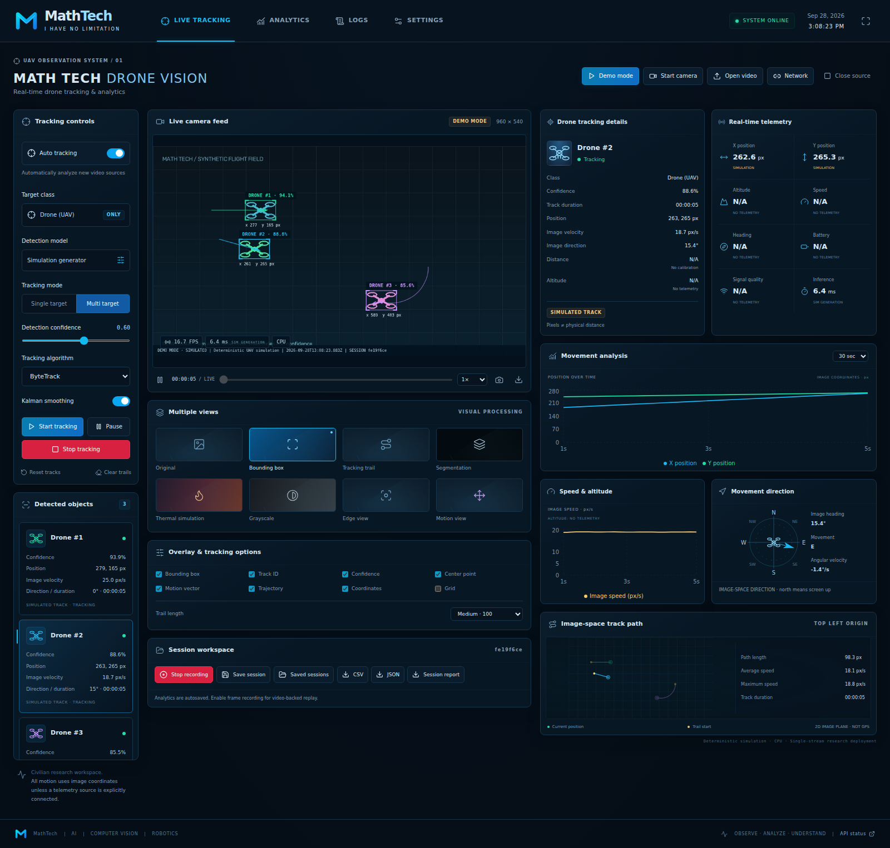

# MATH TECH DRONE VISION
### Real-Time Drone Tracking & Analytics
**MathTech · I HAVE NO LIMITATION**

A complete local research application for civilian UAV observation: React/TypeScript
control-room UI, Python/FastAPI vision service, YOLO inference, ByteTrack, motion
analysis, telemetry provenance, session recording, replay, and exports.



## Start here

1. Install **Python 3.12**, **Node.js 22 or 24**, and npm.
2. Follow the Windows or Linux/macOS setup below.
3. Open **http://localhost:5173** and select **Demo mode**.
4. Three deterministic simulated UAVs appear. Select a track, inspect its graph,
   enable frame recording, save the session, then export or replay it.
5. For real detection, install **your own drone-trained YOLO weights** in
   `backend/models/`, then load them from Settings. **No trained drone detector
   is bundled.** A generic COCO model is rejected when it has no drone/UAV class.

The sample video and demo geometry are explicitly simulated. The automated model
integration test uses a synthetic red-pixel ONNX detector, generated only in a
temporary test directory. It is not a trained drone detector or an accuracy claim.

## What is implemented

- Browser webcam JPEG streaming with camera-permission handling and backpressure.
- MP4/WebM/AVI/MOV/MKV upload, codec validation, metadata, playback, seek and speed.
- Backend USB-camera interface and an opt-in, host-allowlisted RTSP adapter.
- Ultralytics YOLO detection/segmentation; `.pt` and `.onnx` model loading; CPU
  operation, automatic CUDA selection and runtime CPU fallback.
- Official Ultralytics ByteTrack, plus optional DeepSORT with UAV crop HSV
  appearance features; persistent IDs, temporary-loss states and stale expiry.
- Image position, variable-timestep velocity, direction, path length, EMA/Kalman
  smoothing, trajectories, a direction compass and live Recharts plots.
- Eight canvas views: original, boxes, trails, segmentation, thermal simulation,
  grayscale, image gradients, and frame differences. Segmentation is unavailable
  without masks; thermal simulation is always labeled as simulated.
- Provenance-tagged custom telemetry, optional demo telemetry, stale-data expiry,
  and geographic trajectory rendering when actual GPS telemetry is supplied.
- SQLAlchemy persistence: SQLite locally; PostgreSQL in Docker Compose.
- Autosaved analytics, optional JPEG recording, named sessions, paged replay,
  CSV/JSON download, HTML report and PNG snapshots with timestamp/session overlay.
- Live logs, persisted session events, settings, reconnection, API key support,
  file limits, safe filenames, read-only model-class allowlisting and origin checks.
- Dark/light themes, responsive layouts, semantic controls, keyboard focus,
  native accessible dialogs, error boundaries and actionable empty states.

**Deliberate scope:** one shared operator workspace and one video pipeline per
backend process. This is a deployable research implementation, not a validated
multi-tenant hosted product. There are no weapon-control, interception, flight
command, biometric recognition or individual-person tracking functions.

## Windows PowerShell installation

Run these commands from the extracted `drone-vision` folder:

```powershell
Copy-Item .env.example .env
python -m venv .venv
.\.venv\Scripts\Activate.ps1
python -m pip install --upgrade pip
# CPU wheels avoid a large CUDA dependency installation on CPU machines.
pip install torch==2.14.0 torchvision==0.29.0 --index-url https://download.pytorch.org/whl/cpu
pip install -r backend\requirements.txt
# Optional DeepSORT support:
pip install -r backend\requirements-optional.txt
```

Start the backend in terminal 1:

```powershell
.\.venv\Scripts\Activate.ps1
cd backend
uvicorn app.main:app --reload --host 127.0.0.1 --port 8000 --ws-max-size 2100000
```

Start the frontend in terminal 2, from the project root:

```powershell
cd frontend
npm install
npm run dev
```

For repeatable installs use `npm ci` after the first extraction; the lockfile is
included. If your PowerShell policy disallows activation, call the virtualenv's
Python directly instead of changing your machine's policy:

```powershell
.\.venv\Scripts\python.exe -m pip install -r backend\requirements.txt
# The launcher also avoids environment activation:
.\scripts\start-backend.ps1
```

The optional `scripts/start-frontend.ps1` starts Vite from the correct directory.

## Linux / macOS installation

```bash
cp .env.example .env
python3.12 -m venv .venv
source .venv/bin/activate
python -m pip install --upgrade pip
# Linux CPU installation:
pip install torch==2.14.0 torchvision==0.29.0 --index-url https://download.pytorch.org/whl/cpu
pip install -r backend/requirements.txt
pip install -r backend/requirements-optional.txt
cd backend
uvicorn app.main:app --reload --host 127.0.0.1 --port 8000 --ws-max-size 2100000
```

On macOS, install the corresponding PyTorch packages from PyPI instead of the
Linux CPU index (`pip install torch torchvision`). This release selects CPU or
CUDA; it does not select Apple's MPS backend. macOS installation was not exercised
in the build environment.

In another terminal:

```bash
cd drone-vision/frontend
npm ci
npm run dev
```

Open http://localhost:5173. Backend health is http://localhost:8000/api/health.
Swagger is http://localhost:8000/docs; ReDoc is http://localhost:8000/redoc.

## Model setup and real video

1. Obtain or train a licensed YOLO detector whose class metadata includes
   `drone`, `uav`, `quadcopter`, `drones`, `unmanned aircraft` or
   `unmanned aerial vehicle`. Class matching is case-insensitive.
2. Put a trusted checkpoint in `backend/models/drone_detector.pt`, or upload a
   self-contained ONNX export from Settings.
3. **Close source**, select the model, then **Load model** in Settings. Loading
   warms up inference and rejects a model with no supported UAV class.
4. Optionally set `MODEL_PATH=drone_detector.pt` in the root `.env` for loading
   at startup. `MODEL_PATH` resolves to a basename in the configured model folder;
   arbitrary filesystem paths are not accepted over the API.
5. Choose **Open video**, select a file, inspect metadata, and press **Start
   analysis**. Without a loaded model, the video previews with no detections.
6. For webcam use, choose **Start camera** and approve your browser's permission
   prompt. A webcam generally requires localhost or HTTPS. Only one browser may
   publish camera frames at a time; other viewers can observe the stream.

See [model training](docs/MODEL_TRAINING.md) for dataset layout, commands, validation
metrics and ONNX export. Replacing names in a generic detector does not train it
to detect drones. No real-world accuracy percentage is promised by this code.

## RTSP and backend camera

Set the root `.env`, then restart the backend:

```dotenv
ENABLE_RTSP=true
RTSP_ALLOWED_HOSTS=192.168.1.25,camera.lab.example
```

Choose **Network** and enter the RTSP URL. Only `rtsp://` and `rtsps://` and exact
allowlisted hostnames are accepted. Open/read timeouts prevent indefinite camera
blocking. Credentials are not returned in session metadata or browser packets.
Use a network-isolated backend for camera access. RTSP must be tested against
your camera's codec, authentication and network conditions.

A camera physically connected to the backend host can also be started via:

```bash
curl -X POST http://localhost:8000/api/source/start \
  -H 'Content-Type: application/json' \
  -d '{"kind":"backend_camera","camera_index":0}'
```

Docker requires explicit USB-device passthrough for backend cameras; browser
webcams do not need a device mounted into the backend container.

## Measurement semantics

| Quantity | Definition / provenance |
|---|---|
| X, Y | Filtered bounding-box center in the **processed image**; origin top-left |
| Width, height | Detection box size in processed-image pixels |
| Image velocity | Pixels/second using source-frame time, optionally Kalman-smoothed |
| Direction | `atan2(vy, vx)`; 0° right/E, 90° down/S, 180° left/W, 270° up/N |
| Angular velocity | Wrapped change in image direction / source elapsed seconds |
| Path length | Sum of raw observed center displacements; pixels, not ground distance |
| FPS | Actual completed processing frames / wall-clock second; first frame is 0 |
| Inference latency | Detector execution time; demo shows measured simulation-generation time |
| Processing time | Tracking, analysis and image encoding time; excludes acquisition and DB commit |
| Track confidence | Model detection score; simulated score in demo; not calibrated probability |
| Altitude, GPS, physical speed, battery, signal | N/A until explicitly supplied by telemetry |
| Demo data | Deterministic simulated detections and confidence, real tracker/motion calculations |

An uncalibrated monocular camera cannot establish metric distance or altitude.
The UI therefore leaves distance unknown. Changing image resolution or processing
settings creates a fresh analysis segment so coordinate systems are never silently
mixed. Track IDs describe within-session continuity, not permanent aircraft identity.
Occlusion, crossings and missed detections can cause identity switches.

## Sessions, recording, replay and export

- A session begins when a source is opened. Analytics are batched into the database
  every 20 frames or approximately 1 second. A crash can lose the unflushed batch.
- **Record frames** additionally writes original processed JPEGs. It is not an
  audio recording or a browser screen capture. PNG snapshots contain overlays.
- **Save session** gives the current session a name and marks it saved. Analysis
  continues until you pause, stop, or change the source.
- **Saved sessions → Replay** stops the active source and replays stored records.
  If JPEGs were not recorded, the canvas explicitly shows analytics-only replay.
- Replay controls provide play, pause, frame seeking, and speed. Reconstructed
  trails and charts accumulate as the replay progresses. Large sessions are paged.
- File seeking and processing-configuration changes create new analysis sessions;
  this avoids time reversal and geometry-induced motion spikes.
- **CSV** contains measured observation rows; lost predictions are not exported as
  fresh measurements. **JSON** contains metadata and frame packets with provenance.
- **Session report** downloads an HTML report that can be printed to PDF.
- **Clear trails** clears the visible trail buffer, not saved records. **Reset
  tracks** allocates new IDs within the same session. Deletion removes database
  records and JPEGs, after confirmation, and cannot delete an active source.
- Frames/session and JPEG recording quotas are configurable. Delete old sessions
  as part of retention; uploads remain available in `data/videos/` until removed
  by the operator while the service is stopped.

## Telemetry integration

Select **Custom API** in Settings. Every input metric must include value, unit,
recent Unix timestamp, and `source: "telemetry"`. Bind the sensor to an active
track ID deliberately: a visual track is not automatically associated with a
physical aircraft. Provider inputs include altitude, speed, heading, battery,
signal, latitude, and longitude. Values expire after `TELEMETRY_TTL_SECONDS`.

```python
import time, requests
requests.post('http://localhost:8000/api/telemetry', json={
    'track_id': 1,
    'metrics': {
        'altitude': {'value': 62.3, 'unit': 'm', 'timestamp': time.time(), 'source': 'telemetry'},
        'battery': {'value': 78, 'unit': '%', 'timestamp': time.time(), 'source': 'telemetry'}
    }
}, headers={'X-API-Key': 'YOUR_CONFIGURED_KEY'}, timeout=5).raise_for_status()
```

The example uses the optional `requests` client; install it in the sending client
environment. Do not send example values as if they were real aircraft telemetry.
**Simulation** telemetry is restricted to demo sources and remains explicitly
labeled. **MAVLink is not implemented**; its UI choice is disabled.

When latitude/longitude exist, the path panel switches to an actual-coordinate
WGS84 local geographic projection and exposes an OpenStreetMap link. No map tiles
are fetched automatically. The visible GPS trace uses the chart's recent samples;
complete telemetry is retained in JSON exports.

## Docker (CPU)

Docker Desktop / Docker Engine with Compose v2 is required:

```bash
cp .env.example .env
# Set a suitable POSTGRES_PASSWORD before network deployment.
docker compose up --build
```

Open **http://localhost:8080**. This starts frontend Nginx, the backend, and
PostgreSQL. Ports are bound to localhost. Data and uploaded models use named
volumes. Trusted models under `backend/models/` are seeded into the model volume
on container startup without overwriting existing files.

```bash
docker compose logs -f backend
docker compose down
# Only if you intend to delete all persisted Docker data:
# docker compose down -v
```

See [deployment guide](docs/DEPLOYMENT.md) for GPU configuration, backups, TLS,
model volume management and boundaries. The Compose configuration is supplied;
container startup and NVIDIA hardware were not available for execution in the
build environment, so they are separately identified in the verification report.

## Tests and production build

```bash
# From project root, with the Python virtualenv active:
pip install -r backend/requirements-dev.txt
cd backend
pytest -q
cd ../frontend
npm ci
npm test
npm run build
npx playwright install chromium
cd ..
python scripts/run_e2e.py
```

Stop manually started services on 8000/5173 before `run_e2e.py`; it starts its own
isolated services and uses a temporary database. Linux browser environments may
need `npx playwright install --with-deps chromium`.

The real backend suite tests parser filtering, ByteTrack/DeepSORT, motion, Kalman,
telemetry expiry, APIs, WebSockets, source validation, sessions, recorded images,
and CSV/JSON. An ONNX pixel detector fixture exercises the actual Ultralytics /
ONNX Runtime path on generated video. The browser suite exercises a simulated
camera device, UI controls, graphs, settings, snapshots, downloads and replay.

See [verification report](docs/VERIFICATION.md) for the exact executed checks and
[API reference](docs/API.md) for the complete REST/WebSocket contract. `docs/openapi.json`
is generated from the actual FastAPI app; `/docs` remains authoritative at runtime.

## Configuration

The root `.env` is read regardless of the backend's working directory. Persisted
UI settings override confidence/device defaults after the first saved settings.
See `.env.example` for every supported option. To reset UI defaults, stop the
service and remove only the `application` row from the `settings` table; do not
remove a database containing sessions you need to retain.

The frontend uses relative `/api` and `/ws` URLs by default. Vite proxies them to
localhost:8000; Docker's Nginx proxies them to the backend service. For separate
origins create `frontend/.env.local`, set `VITE_API_URL` and `VITE_WS_URL`, and
add the frontend origin to backend `CORS_ORIGINS`. These Vite variables are embedded
at build time. Never put secrets into `VITE_*` variables.

## Project structure

```text
drone-vision/
  frontend/
    src/
      components/    Canvas overlays, controls, details, telemetry, sessions, UI primitives
      pages/         Dashboard, analytics, logs, settings
      layouts/       Navigation, system status, clock, notifications
      hooks/         Reconnecting tracking WebSocket
      stores/        Typed Zustand application state
      services/      REST, browser camera, paged replay
      types/         Shared frontend interfaces
      utils/         Formatting and stable track colors
      charts/        Recharts plots with independent units
      map/           Image paths and actual GPS coordinate paths
      App.tsx
      main.tsx
    e2e/             Playwright acceptance tests
    public/          MathTech vector logo
    Dockerfile
    nginx.conf
  backend/
    app/
      api/           Validated REST endpoints and upload/export handlers
      websocket/     Observer and browser-camera WebSockets
      vision/        Source adapters, model manager, ordered inference worker
      tracking/      ByteTrack/DeepSORT adapters, TrackManager, Kalman filter
      analytics/     Session statistics
      telemetry/     None, simulation, and custom providers
      sessions/      Batched repository, replay, export
      models/        Pydantic request/response schemas
      database/      SQLAlchemy table definitions and engine
      utils/         Structured event logging
      config.py
      main.py
    models/          Operator weights and example dataset YAML
    tests/           Unit and integration tests; synthetic ONNX fixture builder
    requirements*.txt
    Dockerfile
  data/
    videos/          Included synthetic MP4 and ground truth; later uploaded files
    sessions/        Optional recorded JPEG frames
    exports/
    telemetry/
  docs/              API, architecture, SQL schemas, training, deployment, verification
  scripts/           Launchers, E2E runner, synthetic video generator, training helper
  docker-compose.yml
  docker-compose.gpu.yml
  .env.example
```

## Troubleshooting

| Symptom | What to check |
|---|---|
| Dashboard says disconnected | Start backend; confirm `/api/health`; verify proxy/port, API key and CORS origins |
| Demo cannot start | Install all `requirements.txt`, including `lap`; use the pinned Ultralytics version |
| No drone detections | Check that your UAV model is loaded, class metadata is valid, target scale is sufficient and confidence is appropriate |
| Generic YOLO model rejected | Install a model actually trained to recognize drones; do not rename COCO classes |
| Webcam permission denied | Allow browser camera access; close other camera apps; use localhost or HTTPS |
| Webcam transport closes | Use one producer, check connection/key and frame size; restart camera |
| Video won't open | Re-encode to H.264 MP4/WebM supported by your OpenCV FFmpeg build; verify dimensions ≤ 3840×2160 |
| RTSP fails | Enable adapter, allow exact hostname, verify credentials/codec/network route; try the camera in a local player |
| Low FPS | Reduce processing width/FPS target, use a smaller detector, increase frame skipping; actual FPS is reported |
| Altitude/GPS are N/A | Correct: connect recent, explicitly track-associated telemetry; a camera alone does not measure them |
| Replay has no video | Recording was not enabled at that frame; analytics replay remains available |
| IDs change after seeking/settings | Expected: new analysis segments avoid mixing incompatible times or coordinates |
| Segmentation disabled | A detection-only model has no pixel masks; load supported segmentation weights |
| Upload .pt rejected | Install trusted weights locally; browser .pt upload requires an explicit operator environment setting |
| Cannot change model | Close the active source first; model loading is serialized against inference |
| `libGL.so.1` missing on Linux | Install your distribution's `libgl1` and `libglib2.0-0` packages |
| Port already in use | Stop existing services or configure matching backend/Vite URLs and proxy port |
| PyTorch installation fails | Verify Python/platform compatibility and install the matching PyTorch build before application requirements |
| Docker GPU build fails | Check driver support and the configured CUDA wheel index for the pinned torch version |
| Recording stops | JPEG quota reached; analytics continue. Free storage or raise the operator limit |

## Dependency licensing

The application integrates Ultralytics and must be deployed in accordance with
its applicable license. This source distribution is provided under AGPL-3.0-or-later;
see `LICENSE` and `THIRD_PARTY_NOTICES.md`. A proprietary deployment requires a
separate license review and, where applicable, an Ultralytics commercial license.
