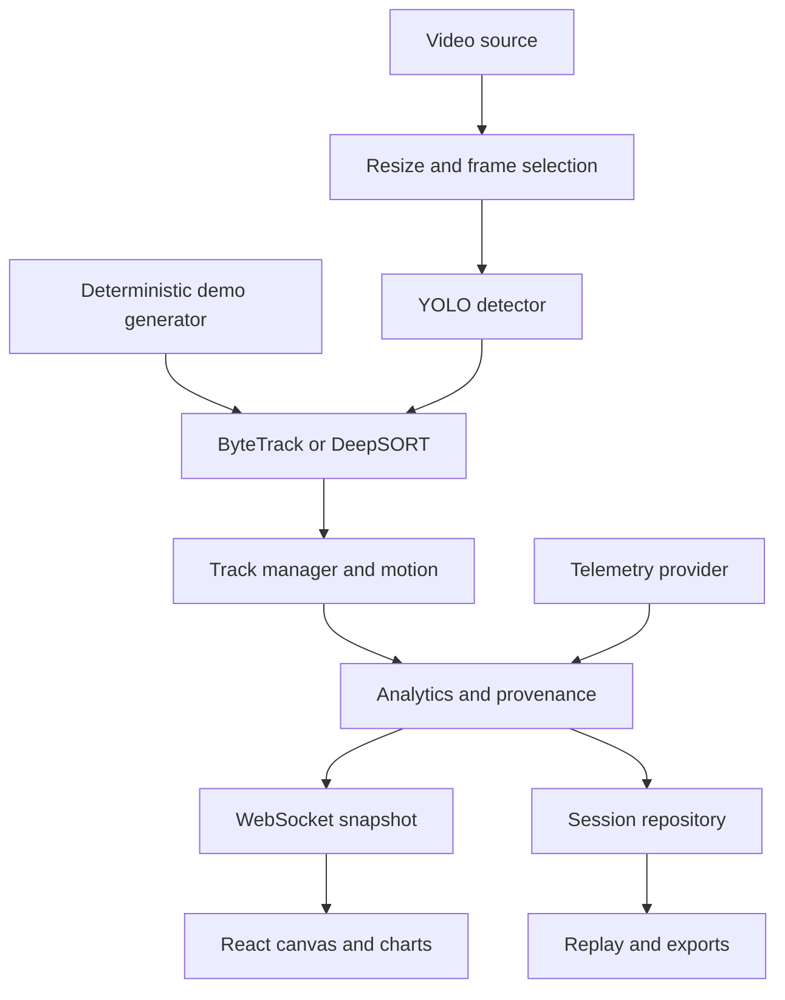

# Architecture and measurement model

## Runtime ownership

One `VisionEngine` owns one source, one model manager, one tracker and one mutable
track manager. FastAPI lifecycle creates it. A dedicated worker thread performs
capture, inference, association, motion calculation, JPEG encoding and batched DB
writes. Blocking source/model commands run in FastAPI's thread pool. WebSockets
retrieve immutable snapshots via the thread pool; they never run YOLO inside the
async event loop. A reentrant lock serializes mutations and model operations.

This design intentionally uses `uvicorn --workers 1`. Multiple Uvicorn workers
would own different camera/session state. To serve multiple cameras, deploy
separate pipeline instances and route each workspace to one instance. User auth,
role-based multi-tenancy, cross-instance routing and fleet orchestration are not
implemented in this release.

## Source times

- Files: decoded frame number divided by the source FPS. This is a nominal CFR
  timeline; variable-frame-rate clips should be transcoded to constant FPS for
  precise kinematic work. OpenCV does not provide a reliable general VFR PTS API.
- Browser cameras: client monotonic capture times, rebased at the first frame.
- RTSP/backend cameras: monotonic receive time; not camera exposure time or GPS time.
- Demo: deterministic source-frame time, independent of machine processing speed.
- Packet `timestamp`: backend Unix receipt/processing wall time.

Real-time processing FPS uses completed worker frames and the monotonic wall
clock. First-frame FPS is 0 because there is no prior interval. Video speeds alter
playback pacing, never the derivative's source-time denominator.

## Motion

For raw observed centers `(x_t,y_t)` and increasing source timestamps:

`vx = (x_t - x_previous) / dt`

`vy = (y_t - y_previous) / dt`

`speed = hypot(vx, vy)`

`direction = degrees(atan2(vy, vx)) mod 360`

EMA smoothing uses `alpha = 1 - exp(-dt / 0.15)`, so its response is roughly
consistent across variable frame rates. The optional Kalman filter instead uses
state `[x,y,vx,vy]`, a constant-velocity transition matrix parameterized by `dt`,
position observations, white-acceleration process noise, and a Joseph-form
covariance update. It returns image coordinates, not metric motion.

Raw displacement accumulates the path length. Average speed is the arithmetic
mean of observed smoothed speed samples. Angular velocity wraps signed differences
to `[-180,180)` before dividing by elapsed source time. At very low speed the last
meaningful direction is held; near-stationary direction is not physical heading.

A lost track preserves its last observation and supplies a separate
`predicted_center`. Predictions do not become fresh CSV observations. Expired
tracks are removed after source-time timeout. The motion smoother supplements
ByteTrack's own association Kalman filter; toggling it does not remove the
tracker's internal prediction model.

## Tracking

ByteTrack is imported from the pinned Ultralytics release, with high-/low-score
association and the configured high threshold. A lower-score detection can sustain
an existing track. The display threshold therefore means high-confidence track
initialization, not that every recovered observation must exceed it.

DeepSORT is optional. To keep the application exclusively object-oriented, it
uses normalized HSV crop histograms as appearance embeddings, not a person
re-identification network. This is a lightweight baseline; similar-looking drones
and crossings still need empirical identity-switch evaluation. Segmentation mask
preservation is currently supported with ByteTrack; DeepSORT returns boxes.

IDs are stable while association holds, scoped to one analysis session. Reset
allocates fresh monotonic display IDs. Processing changes/seek create a new session.
Selected-track filtering affects displayed/exported observations in single mode;
multi mode records all emitted tracks up to the object cap.

## Performance and limits

The ordered worker performs one-frame inference because batching increases live
latency and complicates source-time association. Browser input retains one pending
frame and discards older queued frames. WebSocket observers receive only the newest
packet: slow clients do not accumulate a frame queue. File frame skipping respects
nominal timestamps. The reader also drops source frames when the requested playback
speed would exceed the configured processed-FPS ceiling. Decode/inference bottlenecks
can still slow playback; the configured speed is a pacing target, not a throughput claim. The loop reports achievable FPS and does not fabricate 30 FPS.

Large sessions are paged for replay and streamed for CSV/JSON export. In-memory
trail length, chart history, event logs, camera input, model output count, upload
size, recording size and session frame count are bounded. Recording quotas are
per session. Operators must manage aggregate disk retention across sessions.

## Database

SQLAlchemy models are in `backend/app/database/db.py`. SQL definitions generated
for SQLite and PostgreSQL are in `schema-sqlite.sql` and `schema-postgresql.sql`.
`create_all` initializes a new database; it is not a migration engine. Future
schema upgrades require explicit versioned migrations and backups.

| Table | Purpose |
|---|---|
| sessions | Identity, source/model/algorithm, timestamps, config metadata, statistics |
| frames | Session/frame composite key, full provenance packet, optional image flag |
| tracks | Session/track composite key, first and last observation timestamps |
| track_points | Observed boxes, centers, velocity, direction and provenance |
| telemetry | Timestamped per-track values, units and source labels |
| events | Track lifecycle and persisted session events |
| settings | Validated application configuration |

Session frame JSON omits repeatedly duplicated trail history; replay rebuilds it.
Masks are retained when the detector provides them. Recorded JPEG files live under
`data/sessions/<uuid>/frames/<frame_index>.jpg`. Database queries and disk access
are scoped by validated UUID/integers. Session deletion is explicit and deletes
related rows plus the matching frame directory.
